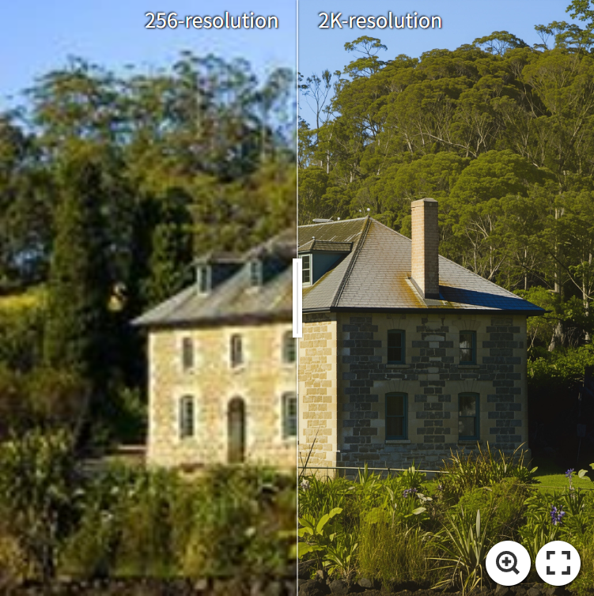
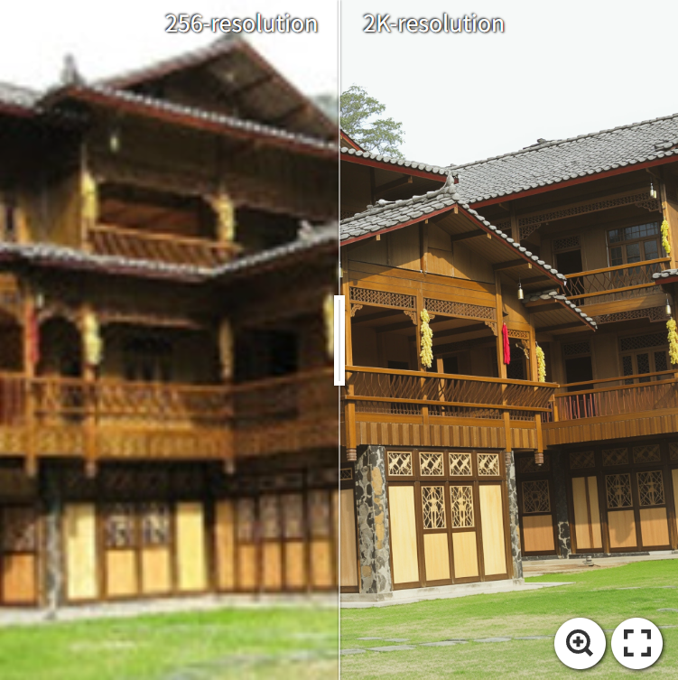
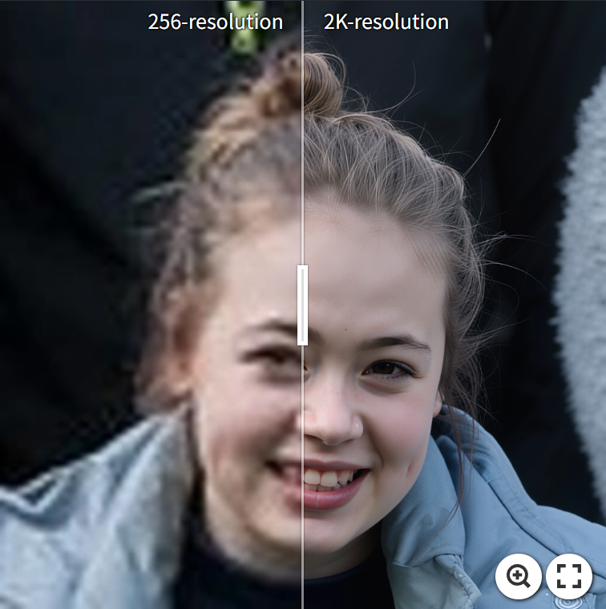
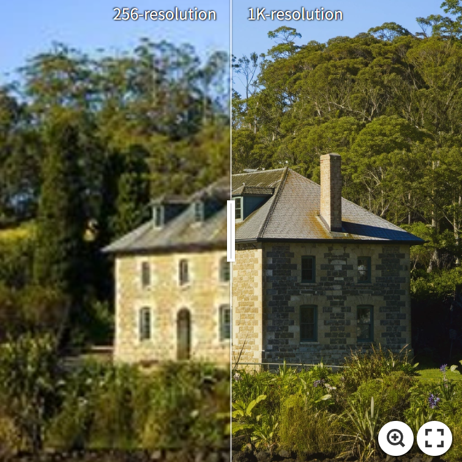
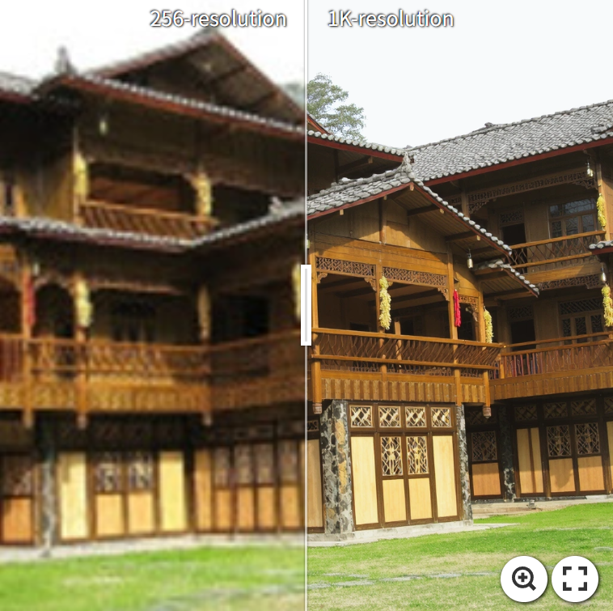
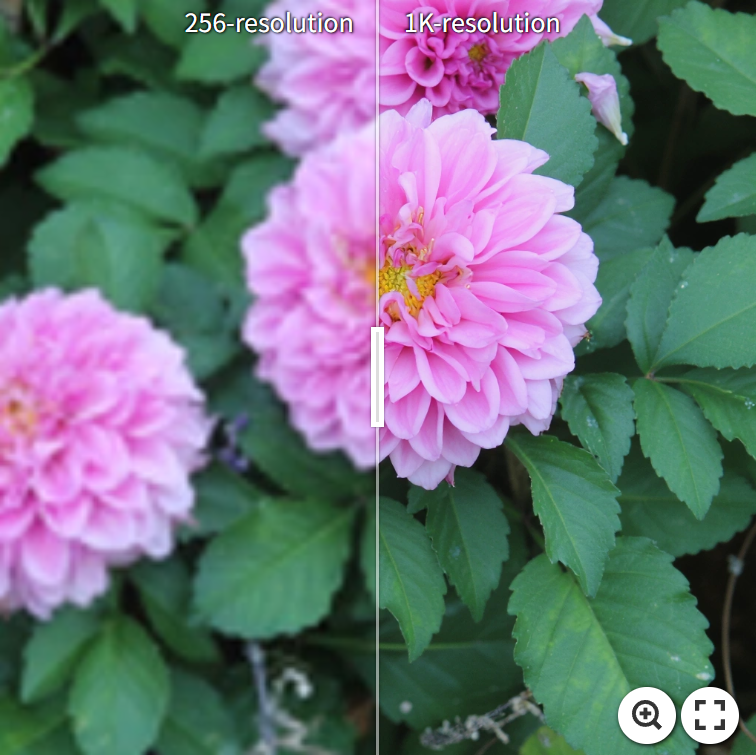
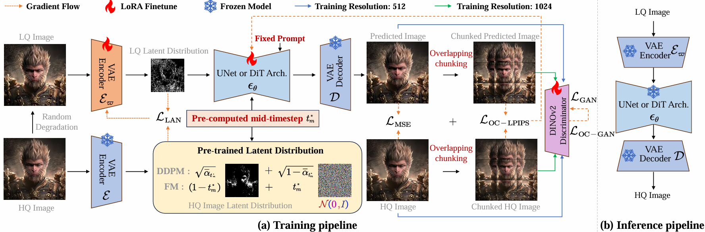

<div align="center">
<h2>OMGSR: You Only Need One Mid-timestep Guidance for Real-World Image Super-Resolution</h2>
<a href='https://arxiv.org/pdf/2508.08227'></a>

Zhiqiang Wu<sup>1,2*</sup> |
Zhaomang Sun<sup>2</sup> | 
Tong Zhou<sup>2</sup> | 
Bingtao Fu<sup>2</sup> | 
Ji Cong<sup>2</sup> |
Yitong Dong<sup>2</sup> |
\
Huaqi Zhang<sup>2</sup> |
Xuan Tang<sup>1</sup> |
Mingsong Chen<sup>1</sup> |
Xian Wei<sup>1&dagger;</sup> 

<sup>1</sup>Software Engineering Institute, East China Normal University | 
<sup>2</sup>vivo Mobile Communication Co. Ltd, Hangzhou, China |
<sup>*</sup>Work done during internship at vivo | 
<sup>&dagger;</sup>Corresponding author
</div>

## :boom: News

- **2025.8.12**: The arXiv paper is released.
- **2025.8.6**: This repo is released.

## :runner: TODO

- [ ] Release the code in a week
- [ ] Release the weight in two weeks
- [ ] Develop OMGSR-Q (Qwen-Image)...

## Visualization

### 2k-resolution demos

These demos are created by 1K-resolution OMGSR-F through our two-stage Tiled VAE & Diffusion process. **Click** the images for comparative visualization.

[](https://imgsli.com/NDA2NjYz)
[](https://imgsli.com/NDA2NjY2)
[](https://imgsli.com/NDA2Njc5)
[](https://imgsli.com/NDA2Njgw)

### 1k-resolution demos

These demos are created by 1K-resolution OMGSR-F. **Click** the images for comparative visualization.

[](https://imgsli.com/NDA2Njgx)
[](https://imgsli.com/NDA2Njgy)
[](https://imgsli.com/NDA2Njgz)
[](https://imgsli.com/NDA2Njgw)

## Training and inference pipelines



## Environment

```
# git clone this repository
git clone https://github.com/wuer5/OMGSR.git
cd OMGSR
# create an environment
conda create -n OMGSR python=3.10
conda activate OMGSR
pip install --upgrade pip
pip install -r requirements.txt
```

## Quick Start

<h3>1. Download the pre-trained models from huggingface</h3>

- Download <a href="https://huggingface.co/stabilityai/sd-turbo">SD-Turbo</a> for OMGSR-S.
- Download <a href="https://huggingface.co/black-forest-labs/FLUX.1-dev">FLUX.1-dev</a> for OMGSR-F.
<h3>2. Download the OMGSR Lora adapters weights</h3>

- Download <a href="#">OMGSR-S-LoRA-adapter</a> to the folder ```adapters```.
- Download <a href="#">OMGSR-F-LoRA-adapter</a> to the folder ```adapters```.

<h3>3. Prepare your testing data</h3>

You should put the testing data (```.png```, ```.jpg```, ```.jpeg``` formats) to the folder ```tests```.

<h3>4. Start to infer</h3>

For OMGSR-S:
```

```
For OMGSR-F:
```

```

<h2>Training</h2>

<h3>1. Prepare your training datasets</h3>

You should download the training datasets ```LSDIR``` and ```FFHQ``` (first 10k images) followed by our paper settings or your custom datasets.

Please generate the path list of training datasets in ```training_dataset.txt``` by:
```
# All LSDIR images
python gen_txt_path.py --path [YOUR LSDIR DATASET PATH] --nums_sample all
# The first 10k FFHQ images
python gen_txt_path.py --path [YOUR FFHQ DATASET PATH] --nums_sample 10000
```
Then you will get the file like
```
xxx.png
xxx.png
...
```

Start to train OMGSR-S at 512-resolution:
```

```

Start to train OMGSR-F at 512-resolution:
```

```

Start to train OMGSR-F at 1k-resolution:
```

```


